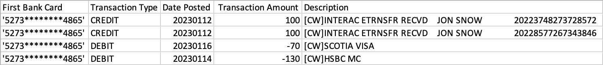
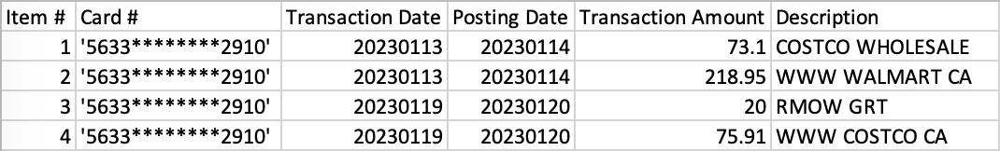
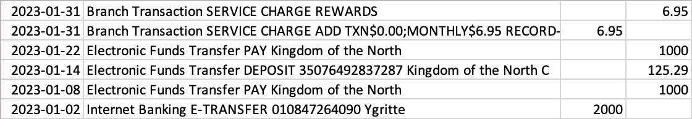
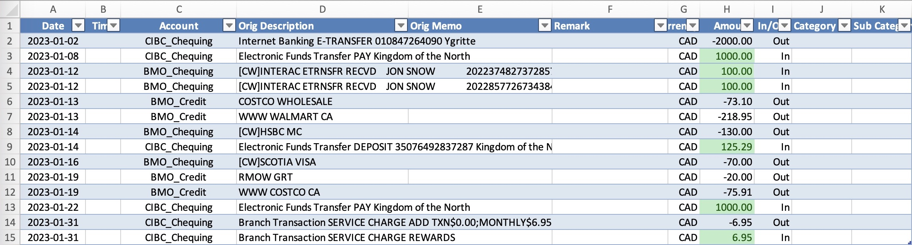

# Examples

This directory contains a simple real-world example for [Bill Aggregator](/../../).

## Background

Jon has 3 bank accounts/cards:

- BMO Chequing Account
- BMO Credit Card
- CIBC Chequing Account

Now, he wants to do a bookkeeping for his recent transactions.

## 1. Download the bills

First, he logs in to these banks' website and downloads the transactions:

- [examples/BMO_Chequing.csv](./BMO_Chequing.csv)<br>
  
- [examples/BMO_Credit.csv](./BMO_Credit.csv)<br>
  
- [examples/CIBC_Chequing.csv](./CIBC_Chequing.csv)<br>
  

## 2. Edit the config

Then, he creates a config file then edits it:

```bash
cp config.example.yaml examples/config.yaml
vim examples/config.yaml
```

Since all his bank accounts exists in [config_templates](../config_templates), he just copies them:

- from [config_templates/BMO_Chequing.yaml](../config_templates/BMO_Chequing.yaml) to [L5-L17](config.yaml#L5-L17)<br>
  ```yaml
    - account: "BMO_Chequing"
      currency: "CAD"
      file_type: csv
      file_config:
        has_header: true
        fields:
          date:
            column: "Date Posted"
          name:
            column: "Description"
          amount:
            format: OneColumnWithSign
            column: "Transaction Amount"
  ```
- from [config_templates/BMO_Credit.yaml](../config_templates/BMO_Credit.yaml) to [L19-L32](config.yaml#L19-L32)<br>
  ```yaml
    - account: "BMO_Credit"
      currency: "CAD"
      file_type: csv
      file_config:
        has_header: true
        fields:
          date:
            column: "Transaction Date"
          name:
            column: "Description"
          amount:
            format: OneColumnWithSign
            column: "Transaction Amount"
            is_outbound_positive: true
  ```
- from [config_templates/CIBC_Chequing.yaml](../config_templates/CIBC_Chequing.yaml) to [L34-L49](config.yaml#L34-L49)<br>
  ```yaml
    - account: "CIBC_Chequing"
      currency: "CAD"
      file_type: csv
      file_config:
        has_header: false
        fields:
          date:
            column: 0
          name:
            column: 1
          amount:
            format: TwoColumns
            inbound:
              column: 3
            outbound:
              column: 2
  ```

## 3. Run the program

All set. He runs the program:

```bash
./main.py -c examples/config.yaml -d examples/
```

## Result

The result is a clean and beautiful Excel table ([examples/results/RESULT.xlsx](./results/RESULT.xlsx)):



After this, Jon can easily add [PivotTables](https://support.microsoft.com/en-us/office/create-a-pivottable-to-analyze-worksheet-data-a9a84538-bfe9-40a9-a8e9-f99134456576)
and [Doughnut Charts](https://support.microsoft.com/en-us/office/add-a-pie-chart-1a5f08ae-ba40-46f2-9ed0-ff84873b7863#__toc348714905)
(in Excel) to further visualize the data.
